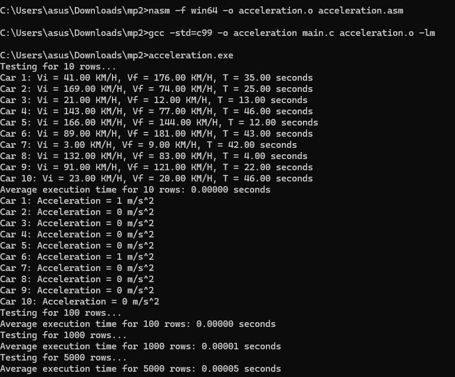

# Acceleration Calculator (C and x86-64 Assembly)

This repository contains a program written in C and x86-64 assembly that calculates the acceleration of a vehicle using the formula:

`a = (Vf - Vi) / T`

where:
- \(V_f\): Final velocity (km/h)
- \(V_i\): Initial velocity (km/h)
- \(T\): Time interval (seconds)

The program performs correctness checks and measures execution times for processing 10, 100, 1,000, and 5,000 rows of input data.

---

## Program Output and Correctness Check

Below is a screenshot of the program's output, showing both correctness checks for sample input data and execution time for varying dataset sizes.

  

---

## Execution Time and Performance Analysis

### Execution Time
| Number of Rows | Average Execution Time |
|----------------|-------------------------|
| 10             | 0.00000 seconds        |
| 100            | 0.00000 seconds        |
| 1,000          | 0.00001 seconds        |
| 5,000          | 0.00005 seconds        |

### Analysis
- The execution time increases linearly with the size of the input dataset.
- For small datasets (10 and 100 rows), the program's execution time is effectively negligible due to efficient computation.
- For larger datasets (1,000 and 5,000 rows), the increase in execution time is minimal, reflecting the program's optimized implementation in both C and x86-64 assembly.
- The combination of C and assembly ensures low-level control and performance, making the program highly suitable for tasks requiring speed and efficiency.

---

## How to Compile and Run

### Requirements
- **Assembler:** NASM (Netwide Assembler)
- **C Compiler:** GCC (with C99 support)
- **Operating System:** Windows (tested with Win64 architecture)

### Steps to Compile and Execute
1. Assemble the x86-64 assembly file:
   ```bash
   nasm -f win64 -o acceleration.o acceleration.asm
   ```
2. Compile the C program and link it with the assembled object file:
   ```bash
   gcc -std=c99 -o acceleration main.c acceleration.o -lm
   ```
3. Run the program:
   ```bash
   ./acceleration.exe
   ```

---

## Authors
Jeri Lei Concepcion and 
Kyla Nicole G. Manaois
